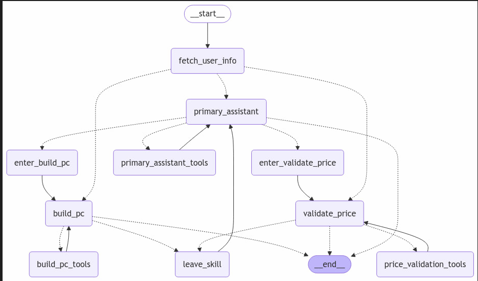

# PC-Build.AI
Advanced multi-agent application designed to automate and optimize the process of custom PC building


## Инструкции для запуска:
1. **Склонируйте репозиторий:**
   ```bash
   git clone https://github.com/ErikWarapaeff/PC-Build.AI
   ```

2. **Создайте виртуальное окружение:**
   ```bash
   python -m venv venv
   ```

3. **Активируйте виртуальное окружеие:**
   - **Windows:**
     ```bash
     venv\Scripts\activate
     ```
   - **macOS/Linux:**
     ```bash
     source venv/bin/activate
     ```

4. **Скачайте все зависимости:**
   ```bash
   pip install -r requirements.txt
   ```

5. **Введите все API ключи:**
   Введите все ключи в  `.env`:
   ```
   OPEN_AI_API_KEY=...
   LANGCHAIN_API_KEY=...
   ```
6. **Запустите приложение на градио:**
   ```bash
   python src/app.py
   ```

7. **Пользовательские настройки:**
   Измените `config/config.yml` если нужно.

   


**Агентный граф:**


